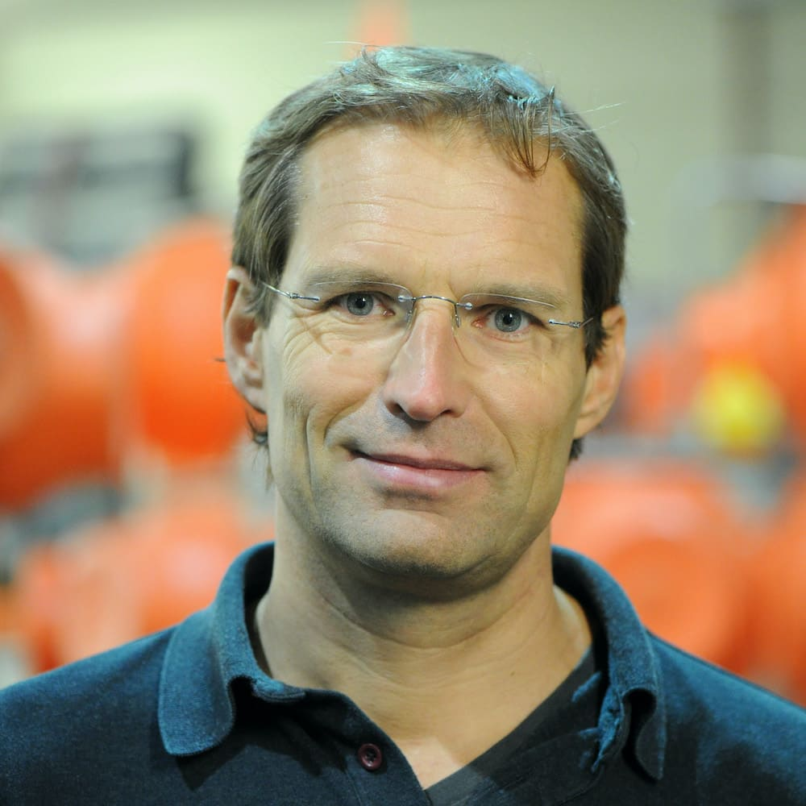

import { Portrait } from 'components/styles'

<Portrait>

# Ulf Riebesell

## Professor of Biological Oceanography

### [GEOMAR Helmholtz Centre for Ocean Research](https://geomar.de)

</Portrait>

- [Education](en/staff/fb2/bi/uriebesell/#c4767)
- [Professional Experience](en/staff/fb2/bi/uriebesell/#c4765)
- [Honours, Awards and Fellowships](en/staff/fb2/bi/uriebesell/#c4687)
- [Memberships, Services, Activities](en/staff/fb2/bi/uriebesell/#c4685)
- [Major research projects](en/staff/fb2/bi/uriebesell/#c4763)
- [Publications](en/staff/fb2/bi/uriebesell/#c4761)

## Research interests

- Biological oceanography
- Pelagic ecology and biogeochemistry
- Plankton physiology and evolutionary biology
- Ocean change biology (acidification, warming, deoxygenation)

## Major research projects

- 2006-2011 AQUASHIFT – The impact of climate variability on aquatic ecosystems (DFG)
- 2007-2015 SOPRAN – Surface Ocean Processes in the Anthropocene (BMBF)
- 2008-2012 EPOCA – European Project on Ocean Acidification (EU)
- 2008-2020 SFB754 – Climate Biogeochemistry Interactions in the Tropics (DFG)
- 2008-2012 CalMarO – Calcification in Marine Organisms (EU)
- 2009-2012 MESOAQUA – Mesocosm Facilities in Aquatic Ecosystems (EU)
- 2009-2017 BIOACID – Biological Impacts of Ocean Acidification (BMBF)
- 2015-2017 ASLAEL – Future change in upwelling systems (BMBF)
- 2016-2018 Humboldt Tipping (BMBF)
- 2017-2020 AQUACOSM – Aquatic mesocosms across ecosystems and climate zones (EU)
- 2017-2021 European Research Council Advanced Grant – Ocean Artificial Upwelling (ERC)

## Publications

- [Articles in scientific journals, peer-reviewed](https://www.geomar.de/en/staff/fb2/bi/uriebesell/articles-in-peer-reviewed-journals/#c13676)
- [Books and Bookchapter](https://www.geomar.de/en/staff/fb2/bi/uriebesell/books-and-bookchapter/#c13673)
- A complete list can be found [here](https://www.geomar.de/en/staff/fb2/bi/uriebesell/publications/#c13674).
