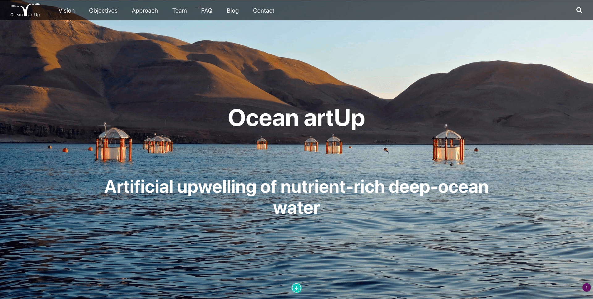

## [Ocean artUp](https://ocean-artup.eu)

Ocean artUp is a research project funded through an Advanced Grant of the European Research Council that explores the possible benefits of artificially-induced uplift of nutrient-rich deep water to the ocean’s sunlit surface layer.

### Vision

Artificial upwelling can contribute to providing food security for a growing human population and supporting the sustainable development of marine fisheries and aquaculture.

### Objectives

Ocean artUp aims to study the feasibility, effectiveness, associated risks and potential side effects of artificial upwelling in increasing ocean productivity, raising fish production, and enhancing oceanic CO2 sequestration.

### Approach

Ocean artUp will employ a combination of experimental approaches at different scales and trophic complexities, perform a field application of forced upwelling in oligotrophic waters, and run model simulations of pelagic systems fertilized by nutrient-rich deep waters.

### Team

Ocean artUp will employ a combination of experimental approaches at different scales and trophic complexities, perform a field application of forced upwelling in oligotrophic waters, and run model simulations of pelagic systems fertilized by nutrient-rich deep waters.
